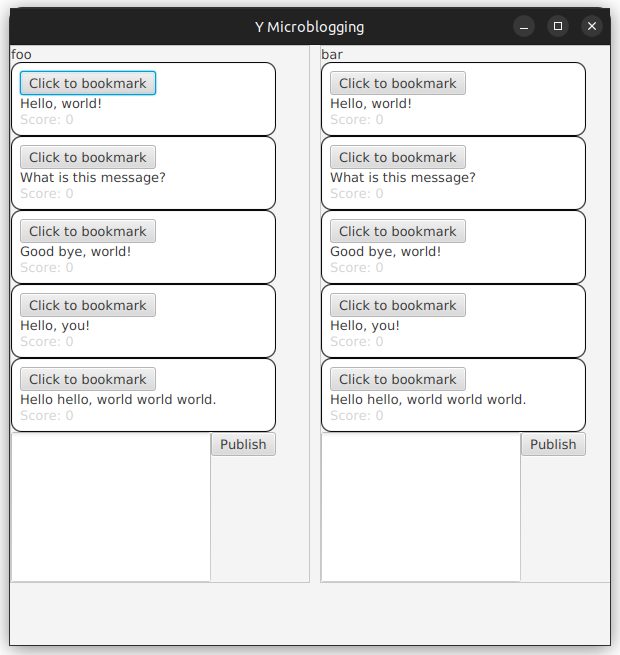

<!-- LTeX: language=fr -->
# MIF01 - TP Remise en route JAVA

**Objectif :**

Il vous est demandé de mettre en place quelques classes pour vous remettre en
tête les grands principes de la programmation orientée objet : messages et
collaboration entre objets, attributs et méthodes, constructeurs, héritage, etc.
Pour cela, vous manipulerez un système de microblogging, inspiré de l'ex-Twitter
ou Mastodon, que nous appellerons Y.

Votre travail servira de base aux TPs suivants qui feront l'objet d'une note
globale (voir le fichier [projet-note.md](../projet-note.md) pour les consignes sur
l'ensemble du projet). Le travail se fait en binômes (malus sur la note pour les
étudiants travaillant seul). Si vous ne trouvez pas de binôme, postez un message
sur l'issue #1 du dépôt enseignant. Pour des raisons logistiques, évitez les
binômes entre un alternant et un étudiant. Il n'y a pas d'autre contrainte pour
cette UE, mais d'autres UE ont des règles différentes.

L'énonce du projet est réparti sur plusieurs fichiers correspondant à plusieurs
séances. Certaines manipulations sont là pour vous guider, d'autres sont
demandées explicitement et prises en compte dans le barème de notation. Pour
vous aider, les tâches notées sont marquées `[BAREME: N]` où `N` est le nombre
de points correspondant. Un récapitulatif est disponible dans
[projet-note.md](../projet-note.md).

Ce TP devrait vous prendre environ une séance.

## Environnement

Pour développer en Java durant le TP, il est fortement recommandé d'utiliser, un
environnement de développement intégré (comme VSCode, IntelliJ IDEA, Eclipse,
Netbeans, etc) qui permet de compiler, de générer un projet, de débugger et
d'exécuter. 

Vous pouvez aussi choisir d'utiliser n'importe quel éditeur de texte avec
coloration syntaxique, mais les outils que nous utilisons dans l'UE sont en
général plus agréables à utiliser via l'intégration IDE.

<!-- TODO: est-ce encore vrai pour Windows ? -->
Le TP n'a été testé que sous Linux. Sur les machines de l'université le TP
fonctionne sous Linux. L'installation des outils Java sous Windows est de
qualité variable selon les années et non-testée par le responsable d'UE (à
utiliser à vos risques et périls, donc). Sur vos machines personnelles, vous
pouvez utiliser l'OS de votre choix.

### Sur les machines du Nautibus sous Linux

Sur les machines du Nautibus, les TPs ont été testés sous Linux, en
utilisant l'environnement Java par défaut (sans rien configurer).

<!--
#### UNIQUEMENT en cas de problème avec l'environnement par défaut

En cas de besoin, il y a aussi une version installée pour vous dans
`/home/tpetu/m1if01/` (à une époque où la version par défaut posait
problème). Pour l'utiliser (en cas de soucis avec la version de base),
avant de démarrer le TP, ajoutez ceci dans votre fichier `~/.bashrc`:

    PATH=/home/tpetu/m1if01/bin:"$PATH"

Puis rechargez le fichier (`exec bash` par exemple). Vérifiez que vous
obtenez bien :

    $ which java
    /home/tpetu/m1if01/bin/java
    $ which javac
    /home/tpetu/m1if01/bin/javac
    $ which mvn
    /home/tpetu/m1if01/bin/mvn
-->

### Sur vos machines personnelles

Sur vos machines personnelles, en cas de problème sous Linux, il peut être
nécessaire d'installer JavaFX explicitement (`sudo apt install openjfx` sous
Ubuntu, ou bien téléchargement depuis [openjfx.io](https://openjfx.io)). Le TP a
été testé avec Java 11, il marchera probablement sans adaptation avec des
versions plus récentes (il faudra peut-être spécifier la version de Java et
JavaFX dans `pom.xml`).

Sur machines personnelles, vérifiez que vous avez bien `git` et `mvn`
installés :

    $ git --version
    git version 2.34.1
    $ mvn --version
    Apache Maven 3.6.3
    [...]

(Vous pouvez bien sûr avoir des versions différentes)

Si ce n'est pas le cas installez-les. Sous Ubuntu, faire :

    apt install git maven

Si quelque chose ne marche pas, regardez si la solution n'est pas documentée dans [FAQ.md](../FAQ.md).

## Création d'un projet sur la forge et récupération du code

Ouvrez dans votre navigateur
[forge.univ-lyon1.fr](http://forge.univ-lyon1.fr). Si vous vous
connectez pour la première fois, le système vous permettra de
vérifier/modifier les informations qui vous concernent, idem pour
votre éventuel binôme.

Nous allons utiliser le dépôt Git du cours comme base pour votre
projet. Ouvrez la page
[https://forge.univ-lyon1.fr/matthieu.moy/mif01](https://forge.univ-lyon1.fr/matthieu.moy/mif01),
et cliquez sur le bouton « fork ». Ce bouton vous permet de récupérer
une copie du projet sur votre espace de la forge.

**IMPORTANT** : pour l'instant, le fork de votre projet est public sur
la forge. Nous vous demandons **impérativement de passer ce projet en
« privé »** pour que vos collègues ne puissent pas recopier votre code.
En cas de copie, nous sanctionnerons sévèrement les étudiants ayant copié **et**
ceux ayant laissé copier leur code. Pour rendre votre projet privé,
rendez-vous dans « settings → general » en bas de la barre latérale de
gauche, puis « Permissions ». Le premier réglage est « Project
visibility ». Dans le menu, choisissez « private », puis cliquez sur
le bouton « save changes ».

Pour vérifier que votre projet est bien privé (indispensable),
retournez à la page d'accueil de votre projet
(`https://forge.univ-lyon1.fr/votre.nom/mif01`) et copiez l'URL.
Ouvrez une fenêtre de navigation privée
(<kbd>Control</kbd>+<kbd>Shift</kbd>+<kbd>P</kbd> sous Firefox,
<kbd>Control</kbd>+<kbd>Shift</kbd>+<kbd>N</kbd> sous Chrom{e,ium}), et collez l'URL de votre projet
dans la barre d'URL. Comme le projet est privé, vous devez avoir le
message « You need to sign in or sign up before continuing. ». Si ce
n'est pas le cas, vous avez raté quelque chose, recommencez la
manipulation.

Bien sûr, il faudra donner les droits à vos enseignants, cf.
[projet-note.md](projet-note.md), et à votre binôme. Tout cela se fait dans
Configuration → Membres.

Pour vos projets futurs, vous pourrez aussi créer des projets à partir
de zéro. Pour cela, vous pourrez faire simplement « new project »
(bouton **+** en haut de l'écran).

Récupérez une copie locale du code avec la commande (l'URL est à
ajuster et vous est donnée par la forge quand vous ouvrez votre projet
avec votre navigateur) :

```
git clone https://forge.univ-lyon1.fr/votrelogin/mif01.git
cd mif01
```

[En cas de problème, voir la FAQ de la forge](https://forge.univ-lyon1.fr/EMMANUEL.COQUERY/forge/wikis/FAQ).

Une fois le clone fait, indiquez l'URL de votre projet (la même pour les deux
membres du binôme) sur TOMUSS. Voir consignes détaillées dans
[projet-note.md](projet-note.md).

Ce fork est votre version du projet, c'est là que vous ferez votre développement.
En cas de mise à jour du dépôt du cours, votre dépôt ne recevra pas
automatiquement les mises à jour. Nous verrons au TP2 comment récupérer facilement les mises à jour depuis le dépôt enseignant.

## Premier contact avec le projet

On vous fournit un squelette [microblog/](../microblog/).

Le projet utilise l'outil Maven pour la compilation. Nous en parlerons
plus en détails en CM, pour l'instant vous devez seulement savoir :

- Le projet est décrit dans le fichier `pom.xml`. Vous pouvez regarder
  le contenu de ce fichier, mais vous n'avez pas besoin de le modifier
  pour ce TP.
  
- `mvn compile` compile le projet

- `mvn exec:java` ou `mvn javafx:run` lancent le programme compilé

### Premier contact avec l'application

Lancez l'interface graphique (`mvn exec:java`). Vous devriez voir s'afficher une
fenêtre avec quelques messages prédéfinis :



Vous pouvez entrer du texte dans le champ en bas de la fenêtre, valider avec la
<kbd>Control</kbd>+<kbd>Entrée</kbd> ou le bouton « Publish ».

### Le code source du squelette fourni

Le squelette contient ces classes :

-   `view.JfxView` : une classe gérant l'interface graphique. Vous pouvez jeter
    un œil au code source de cette classe. Si vous trouvez le code propre, ce
    cours est là pour vous montrer que ce n'est pas le cas, il y a beaucoup de
    choses dans ce squelette qu'un bon programmeur ne fait *jamais*. Bien sûr,
    toutes ces horreurs devront avoir disparues de la version finale que vous
    rendrez.

-   Un embryon de package `model.*` : pour gérer la logique de l'application,
    ici le classement des messages.

-   `App` : le point d'entrée de l'application, qui gère la création de
    l'application.

Le squelette de code fait une première séparation entre l'interface
graphique (package `view`) et la logique métier (package `model`).
Nous verrons plus tard que cette séparation est encore plus
qu'imparfaite et vous demanderons de refactorer le code.

### Documentation de Java et JavaFX

Consultez la documentation de [Java
11](https://docs.oracle.com/en/java/javase/11/docs/api/index.html) et de
[JavaFX Graphics](https://openjfx.io/javadoc/11/)
(la bibliothèque graphique utilisée).

### Chargement du projet dans un IDE (VS Code, Eclipse, IntelliJ, Netbeans ..)

Si vous souhaitez utiliser un IDE, votre IDE favori propose
probablement une prise en charge de Maven, et configurera donc le
projet automatiquement depuis le `pom.xml` :

- VS Code : installer le plugin [Java Extension Pack](https://marketplace.visualstudio.com/items?itemName=vscjava.vscode-java-pack) qui apporte le support du langage Java, de Maven, ... Faire menu File → Open Folder (<kbd>Controle</kbd>+<kbd>k</kbd> <kbd>Controle</kbd>+<kbd>o</kbd>) puis choisir le répertoire. Une section « Maven Projects » doit s'ajouter à la barre latérale de gauche, et vous pourrez sélectionner les actions à effectuer (`exec:java` dans la section `exec` pour lancer l'application). Si vous n'avez pas la complétion intelligente et la navigation dans le code, vous devrez sans doute positionner votre variable de configuration `java.home` : faire avec <kbd>Control</kbd> + <kbd>,</kbd>, puis chercher `java.home` et « edit in settings.json ». Au Nautibus, la configuration est :
<pre>
"java.home" : "/usr/lib/jvm/java-21-openjdk-21.0.4.0.7-2.fc40.x86_64"
</pre>
<!-- TODO ça c'est la version installé à la main -->

- Eclipse : installer le plugin [m2e](http://www.eclipse.org/m2e/), puis importer le projet en
  temps que projet Maven (File → Import... → Maven → Existing Maven Projects). Au Nautibus, Eclipse
  est installé dans `/home/tpetu/m1if01/bin/eclipse` avec m2e installé. Pour lancer l'application,
  on peut au choix utiliser « Run as ... » → « Java application » (mais cf. ci-dessous pour une
  erreur fréquente), ou « Run as ... » → « Maven Build... » puis choisir le goal « exec:java ».

- IntelliJ et Netbeans : le support de Maven est inclus de base dans l'outil. Il
  suffit d'ouvrir le répertoire contenant le `pom.xml`.

Il n'est pas rare qu'il y ait de mauvaises interactions entre un IDE et JavaFX, nous avons essayé de documenter les problèmes et solutions dans [FAQ.md](../FAQ.md).

## Travail demandé

Dans un premier temps, conservez l'architecture (répartition en
classes et packages) fournie. Nous verrons bientôt comment réorganiser
le tout.

### Fonctionnalité : Affichage des messages en bookmark en premier [BAREME: 1]

Le squelette de code fourni affiche les messages triés par ordre de pertinence.
On a considéré qu'un message était pertinent quand il contenait des mots communs
avec les messages bookmarkés (autrement dit, le système recommande des contenus
similaires à ceux qui ont plu a l'utilisateur). Le calcul de similitude donne un
score qui est affiché en grisé sur chaque message.

Les messages bookmarkés ont naturellement un bon score, mais n'apparaissent pas
toujours en sommet de liste. Modifiez la fonction de tri pour que les messages
bookmarkés apparaissent toujours en haut de liste. Si vous ne trouvez pas où
modifier le code, vous pouvez utiliser `git grep`, par exemple
`git grep -n compare` pour rechercher les occurrences du mot `compare` dans le code.

### Stockage de la date de publication [BAREME: 1]

Pour l'instant, les messages sont des objets très simples qui ne stockent que
leur contenu (une chaîne de caractères), cf. la classe `Message`. Faites en
sorte que la date de publication des nouveaux messages enregistre la date de
création ([new
Date()](https://docs.oracle.com/javase/8/docs/api/java/util/Date.html#Date--)
permet d'obtenir la date courante), et que celle-ci soit affichée en dessous du
message
([SimpleDateFormat](https://docs.oracle.com/javase/8/docs/api/java/text/SimpleDateFormat.html)
peut vous aider). Il devrait être assez facile de l'ajouter à la classe
`Message`, mais dans l'état actuel du code, il n'est pas évident de préserver
cette donnée quand la liste des messages est triée (elle l'est automatiquement
après chaque publication). Vous pouvez tester en mettant en commentaire l'appel
à la fonction `sortMessages()` temporairement.

En effet, en l'état les données sont stockées directement dans les classes
JavaFX de l'interface graphique. Le tri des messages récupère ces données telles
qu'elles sont affichées (via `JfxView.getMessages()`) avant de faire le tri, et
je ré-injecter ces données dans l'interface (`JfxView.setMessages()`).

On pourrait s'amuser à modifier `JfxView.getMessages()` et
`JfxView.setMessages()` pour préserver la date, mais profitons-en plutôt pour
remarquer à quel point le code est horrible (vous implémenterez une gestion plus
raisonnable des dates après refactoring). Le code de `JfxView.getMessages()` en
particulier est une abomination qui devra absolument disparaître avant votre
rendu final.

### Problèmes avec la base de code fournie

Réfléchissez maintenant à l'architecture du code. Posez-vous les
questions (rhétoriques ?) suivantes :

- Est-ce facile de modifier l'interface graphique sans changer la
  fonctionnalité ?
  
- À l'inverse, des fonctionnalités comme le tri des messages devraient être
  indépendantes de l'interface graphique utilisée. Un début de séparation a été
  fait via la classe `MessageData`, mais l'appel à lo fonction `sorted` qui fait
  le travail effectif de tri reste dans une méthode de `JfxView` qui ne devrait
  contenir que de l'affichage.
  
- Si vous deviez avoir plusieurs interfaces possibles (par exemple un
  mode « expert » et un mode « débutant » avec moins de boutons, ou
  une interface web et une interface graphique JavaFX), pourriez-vous
  le faire facilement sans dupliquer le code de la logique métier ?
  
- Quelles sont les responsabilités de la classe `JfxView` ? Est-ce
  compatible avec le [Principe de Responsabilité
  Unique](https://en.wikipedia.org/wiki/Single_responsibility_principle) ?

Quelques éléments de réponses sont disponibles dans le fichier
[architecture-et-dependances.md](architecture-et-dependances.md). Ne
les lisez pas avant d'y avoir réfléchi vous-mêmes.

## Si vous avez fini ...

Passez au [TP2](../TP2-outils) !
