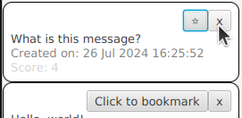

<!-- LTeX: language=fr -->
# TP3 - Design patterns

## Objectifs

Il vous est demandé d’effectuer une ré-ingénierie d’un code existant en mettant en œuvre les patrons de conception vus en cours.

Ceci devrait vous prendre 2 ou 3 séances.

### Déroulement

Ce TP est organisé en deux étapes :

- une ré-ingénierie (refactoring) du code utilisé dans les premiers TP afin de mieux structurer le projet et de le rendre plus modulaire,
- l’extension des fonctionnalités pour réaliser un programme plus complet.

Le plus simple est de partir répertoire `microblog/` fourni dans votre archive. Si vous le souhaitez (mais ce n'est pas la solution recommandée, à vos risques et périls), vous pouvez aussi repartir d'un répertoire vierge, mais attention à ne rien oublier au passage, et si vous faites cela, vous n'aurez plus la possibilité de récupérer les mises à jour du squelette avec un simple `git pull moy master` !

### Ressources

- [Cours (et pointeurs à la fin du cours) sur les Design patterns](https://perso.liris.cnrs.fr/lionel.medini/enseignement/M1IF01/CM-patterns.pdf)
- [Aide à la mise en place du pattern MVC pour ce TP](./mvc.md)

## Consignes

Il est demandé de travailler en binômes.

Vous devriez avoir déjà rempli le champ URL sur TOMUSS pour indiquer votre dépôt forge et votre binôme,
*Cf*. instructions dans [../projet-note.md](../projet-note.md). Si ce n'est pas encore fait, faites-le maintenant.

### Outils

Il est conseillé d'utiliser un IDE capable de générer des diagrammes UML à partir du code, ou mieux, de faire du __round-trip engineering__ (prendre en compte les modifications du code dans les schémas et inversement). C'est le cas avec IntelliJ, et Eclipse avec un plugin comme [Object Aid](https://www.objectaid.com/) (explications rapides en vidéo [ici](https://www.youtube.com/watch?v=0Zlh56mTS6c)). VS Code n'est pas très bon pour cela, donc si vous utilisez VS Code, le mieux est de passer par un outil externe si vous voulez générer des diagrammes UML.

Il est aussi possible de [générer un diagramme de classe via JavaDoc et PlantUML](https://github.com/talsma-ict/umldoclet), le fichier `pom.xml` fourni tente de faire cela (`mvn javadoc:javadoc` ou `mvn site`). Attention, on trouve beaucoup de documentation sur le web sur un doclet UMLGraphDoc, mais celui-ci est cassé depuis Java 8.

### Qualité du code

Le but de ce cours en général est de vous apprendre à écrire du code propre (irréprochable ?). 
On accordera une attention particulière à la qualité du code à tous les niveaux (style, indentation, architecture...). 
Privilégiez la qualité du code à la quantité de fonctionnalités.

## Partie 1 : Ré-ingénierie

Le code fourni lors de la première séance est ensemble de classes
relativement fouillis (nous en avons déjà parlé dans
[architecture-et-dependances.md](../TP1-java/architecture-et-dependances.md)).
En particulier les couches graphique (la vue) et métier (le modèle) ne sont pas séparées.
Il va vous falloir réorganiser le code en appliquant les patrons de conception adéquats.

### Pattern Modèle-Vue-Contrôleur [BAREME: 3]

Vous allez maintenant redéfinir la structure de base de l’application.
Mettez en place un pattern MVC pour :

- séparer le métier (la logique de l'application) et l’affichage
  des éléments (boutons et champs textes),

- propager les changements du modèle métier (statut des utilisateurs, ...) dans la vue,

- répercuter les entrées utilisateur (clic sur un bouton, validation
  d'un champ texte avec la touche « entrée »...) sous la forme
  adéquate dans le modèle métier.

Pour vous aider, vous pouvez utiliser les slides du cours sur les patterns contrôleur et MVC, ainsi que le document [Mettre en place le pattern MVC](mvc.md). Ce document propose des questions pertinentes à se poser, ainsi que quelques éléments de réponses, mais ce ne sont ni les seules questions ni les seules réponses pertinentes.

**Pour chacun des patterns implémentés à partir de cette partie, vous décrirez (en 1 ou 2 paragraphes) pourquoi vous avez choisi de l'utiliser, et vous fournirez dans votre rapport un/des diagramme(s) UML illustrant comment vous l'avez mis en œuvre.**

#### Flexibilité du modèle MVC : deux vues correctement synchronisées [BAREME: 1]

Une des propriétés du MVC est qu'on peut avoir un nombre quelconque de vues, identiques ou non, d'un modèle donné.
On peut vérifier simplement que notre MVC vérifie cette propriété en ajoutant quelque chose comme ceci dans le programme principal :

```java
    public void start(final Stage stage) throws Exception {
        // First view, provided in skeleton
        new JfxView(stage, 600, 600);

        // Second view
        new JfxView(new Stage(), 400, 400);
    }
```

Vous devriez voir une deuxième fenêtre, de taille différente, qui affiche
l'interface graphique. Les deux fenêtres doivent être synchronisées : toutes les
actions importantes faites dans l'une est répercutée immédiatement dans l'autre
(bien sûr, il y a aussi des choses qui restent locales à la vue, par exemple
quand des caractères dans un champ texte, le texte entré n'est propagé
vers le modèle et les autres vues qu'au moment où on valide avec le bouton « correspondant »).

Dans le squelette fourni, les deux vues ne sont pas synchronisées : une
modification faite dans une fenêtre n'est pas visible dans l'autre. Si vous avez
fait correctement le passage en MVC, tout ceci doit être corrigé.

Remarque : si la deuxième fenêtre vous gêne, mettez en commentaire le
morceau de code concerné, mais conservez-le obligatoirement et vérifiez qu'il marche
toujours au moment du rendu.

### Principes GRASP bien respectés [BAREME: 1]

Reprenez les transparents du cours et parcourez la liste des patterns GRASP. Assurez-vous que ceux-ci sont bien respectés dans votre projet.

### Design-patterns (création, structure, SOLID, ...) : au moins 3 autres patterns que MVC ou GRASP [BAREME: 5]

Relisez également la liste des patterns de création, de structure, des principes SOLID, et posez-vous la question de leur applicabilité sur votre projet.
Appliquez ceux qui vous semblent pertinents, et de la même façon que précédemment, documentez cela dans votre rapport (si possible, en suivant la progression du cours : GRASP, création, structure...).

Vous devrez avoir au moins 3 patterns autres que MVC ou GRASP appliqués dans votre projet et décrits dans votre rapport. On considère que le pattern « Observer » fait partie de MVC et ne compte pas dans les 3.

### Anticiper sur le TP 4 "test"

Avant d'aller plus loin sur les extensions, c'est une bonne idée de progresser en tests : nous serons plus en sécurité pour continuer le refactoring et les extensions avec une bonne base de tests. 
Allez jeter un œil au [TP "Test"](../TP4-tests/README.md) (en particulier la section sur le TDD), et revenez pour la suite de ce TP après.
À vous de voir dans quel ordre vous voulez avancer précisément.

## Partie 2 : Extension

Dans toute cette partie, l'ajout de fonctionnalité est un prétexte pour se servir de design patterns. Dans la vraie vie, bien sûr, c'est au client ou à l'expert métier de décider des fonctionnalités pertinentes, mais exceptionnellement dans ce projet un peu artificiel on peut s'autoriser à choisir une fonctionnalité parce qu'elle sera intéressante à implémenter.
Ajoutez chaque fonctionnalité en appliquant les principes et patterns vus en cours, et justifiez-la dans le rapport.

### Rappel des extensions obligatoires du TP1

Pendant le TP1, vous avez dû faire ces modifications :

- Affichage des messages en bookmark en premier

- Stockage de la date de publication

Assurez-vous que ces modifications fonctionnent toujours et qu'elles sont codées
proprement en suivant le principe MVC. Si vous aviez laissé en plan le stockage
de la date de publication en attendant que la base de code soit assez propre,
c'est le moment de terminer le travail.

### Fonctionnalité : bonus de score pour les messages récents [BAREME: 1]

Pour vérifier que votre base de code est bien évolutive : ajoutez une autre
stratégie de calcul de score pour les messages : les messages postés il y a
moins de 7 jours auront un bonus d'un point, ceux postés il y a moins de 24
heures un bonus supplémentaire d'un point.

### Fonctionnalité : autre règle de scoring des messages [BAREME: 1]

Sur le même principe que le bonus de score pour les messages récents, ajoutez au
moins une autre règle de calcul du score (par exemple, un score plus ou moins
élevé selon la longueur du message, selon s'il contient certains mots
prédéfinis, une modération automatique qui ajoute un fort malus sur les messages
contenant des mots interdits, etc.)

Ces ajouts ne doivent modifier que le modèle, et autant que possible doivent se
faire sans ajouter de code aux classes existantes (pas d'ajout de `else if` ou
de `case` dans un `if/else if` ou un `switch` existant !). Vous pouvez même vous
amuser à [métaprogrammer](https://github.com/ronmamo/reflections) cela pour
qu'on puisse simplement ajouter des classes dans un paquet pour ajouter des
règles de scoring (sans aucune autre modification de la base de code, le mieux qu'on puisse
faire en termes de couplage faible).

Attention bien sûr à maintenir votre code factorisé au maximum : pas
de duplication de code d'une stratégie à l'autre !

Si vous êtes tentés d'écrire du code de la forme

```java
if (strategie == 1) { // NON
    ...
} else {
    ...
}
```

Relisez votre cours sur les design-patterns, il y a plus propre et extensible
... (et non, un `switch` à la place du `if / else if / else` n'est pas une
solution satisfaisante : ajouter une stratégie demanderait de modifier le code
existant).

### Fonctionnalité : seuil de score pour afficher les messages [BAREME: 1]

Faites en sorte que les messages ayant un score inférieur ou égal à un seuil ne
soient pas affichés. Avec un seuil 0, les messages plus vieux qu'une semaine et
n'ayant pas reçu de bonus de score disparaîtront pour ne pas polluer la liste.
Bien sûr, l'ajout d'un bookmark peut remonter le score d'un message qui avait
disparu, et les vieux messages doivent pouvoir ré-apparaître lorsque leur score
dépasse le seuil.

### Fonctionnalité : choix de la stratégie de calcul de score et d'affichage [BAREME: 2]

On souhaite maintenant que chaque utilisateur puisse paramétrer l'affichage. Pour simplifier, on donnera le choix entre les stratégies pré-définies suivantes :

- Tous les messages, ordre chronologique

- Messages pertinents récents (bonus de score pour les messages récents et seuil
  de score comme ci-dessus)

Utilisez la classe `ComboBox` de JavaFX (voir par
exemple [ce tutorial](https://melo-code.com/javafx-combobox/)). Cette classe
permet de créer un menu déroulant à partir d'une liste de `String`, ce qui ne
serait pas une très bonne idée (cela nous obligerait ensuite à analyser les
chaînes de caractères pour choisir la stratégie, donc une modification de
l'interface comme une traduction des chaînes de caractères dans une
autre langue casserait tout). Il est beaucoup plus judicieux de créer le menu à
partir d'une liste de classes, chacune implémentant la méthode
`toString()` correctement. Autrement dit, c'est une mauvaise idée d'utiliser
`ObservableList<String>` ici. Et d'une manière générale, les chaînes de
caractères de l'interface utilisateur ne doivent jamais être utilisées dans la
logique métier.

### Fonctionnalité : une troisième stratégie de scoring et d'affichage [BAREME: 1]

Ajoutez maintenant une stratégie de recherche « Messages les plus pertinents »,
avec seuil de score comme ci-dessus. La date n'est utilisée que pour départager
les ex-æquo.

Là encore, si vous avez bien travaillé à l'exercice précédent, cela doit se
faire en ajoutant une classe (triviale) et en l'ajoutant à une liste de
stratégies disponibles, mais le code existant ne doit pas être modifié.

### Fonctionnalité : configuration initiale (utilisateurs et messages prédéfinis) [BAREME: 2]

Jusqu'ici, nous avons pour simplifier utilisé une configuration initiale codée
en dur dans `Y.createExampleMessages()`. C'est bien pratique pour tester un
premier prototype, mais coder en dur du code d'exemple au milieu d'une classe
destinée à être déployée en production est une mauvaise idée.

Implémentez un moyen plus propre de créer une configuration initiale au
lancement de l'application, sans perturber le code réel de l'application. Cette
fonctionnalité devra être au minimum dans une classe séparée, et pourquoi pas
dans un fichier de configuration externe, éventuellement persistant d'un
lancement à l'autre (bien sûr si nous écrivions une vraie application, ce serait
le cas avec une base de données et probablement un
[DAO](https://en.wikipedia.org/wiki/Data_access_object)).

### Fonctionnalité : Modification de l'interface pour les messages (bouton pour supprimer) [BAREME: 1]

Modifiez l'interface pour ajouter à chaque message un bouton permettant de le
supprimer :



Cliquer sur le bouton doit supprimer le message. La modification est
immédiatement répercutée pour tous les utilisateurs. Pour faire simple, le
bouton est simplement créé avec `new Button("x")` (on aurait pu utiliser une
icône plus propre). On peut faire un peu plus joli en groupant le bouton de
fermeture et le bouton « bookmark » dans un `HBox` en haut de la boîte du
message (c'est le cas dans le screenshot ci-dessus).

Cette modification change la structure des éléments JavaFX et casserait
certainement le code du squelette (qui s'attend à trouver un `Label` sur lequel
appeler `getText` directement sous le premier `HBox`). Si vous avez codé votre
MVC correctement, le changement doit maintenant se faire sans douleur.

### Autres extensions [BAREME: 3]

Vous n'en avez pas assez ? Vous voulez ajouter d'autres fonctionnalités ? De
quoi s'abonner à un utilisateur en particulier ? Appliquer le pattern d'UI
[Continuous Scrolling](https://ui-patterns.com/patterns/ContinuousScrolling) ?
Du big data pour mieux prédire quels messages un utilisateur est susceptible
d'apprécier ? Une interconnexion avec des vrais réseaux sociaux via leur API web
?

À vous de jouer. Bien sûr, gardez en tête que l'objectif principal de l'UE est
d'écrire du code irréprochable, donc ne vous lancez dans des extensions que si
vous avez déjà quelque chose de très solide sur la partie cadrée du projet.

## Rendu du TP / projet

Voir les consignes **À RESPECTER IMPÉRATIVEMENT** dans
[../projet-note.md](../projet-note.md).
